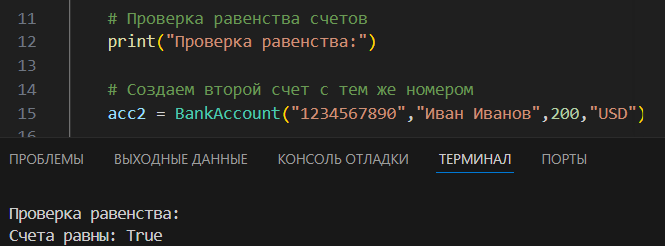
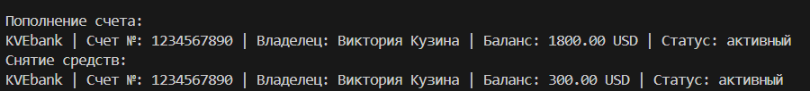
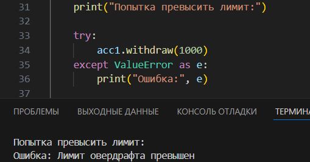
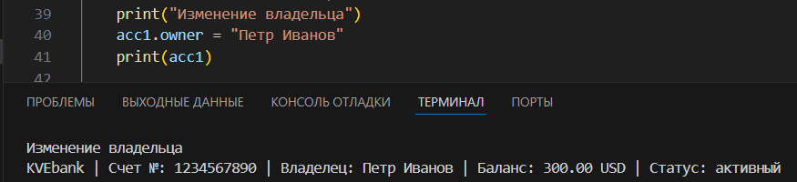
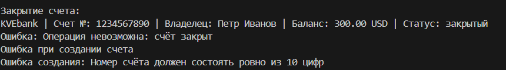

# Лабораторная работа 1 (Класс и инкапсуляция)
#### Выполнен вариант с банковским счётом (№4)

## Анализ:

### Вопрос №1.  Что является сущностью? - банковский счёт

### Вопрос №2. Какие атрибуты будут у данного объекта? 
* уникальный номер (`account_ID`)
* владелец (`owner`) 
* баланс (`balance`)
* валюта (`currency`)
* состояние счёта (`активный/закрытый`)
* лимит овердрафта(`overdraft_limit`)
### Вопрос №3. Какие будут инварианты?
* в уникальном номере ровно 10 цифр
* владелец не может быть пустой строкой
* баланс >= -овердрафт
* лимит овердрафта >= 0
* валюта = {"USD","EUR","RUB"}

### Вопрос №4. Когда два объекта считаются равными?
Два объекта считаются равными если их уникальные номера равны

### Вопрос №5. Есть ли у объекта состояние?
Да, есть. Счёт модет быть открытым или закрытым. Отсюда вытекают следующие правила: 
* если счёт открыт - можно его пополнять либо выводить средства
* если счёт закрыт - никакие операции нельзя производить

## Демонстрация сценариев
**Создание счёта**

**Проверка равенства двух счетов:**

**Пополнение и снятие средств:**
 + попытка превысить овердрафт лимит:

**Изменение владельца:**

**Закрытие счёта и попытка провести какие либо операции:**
