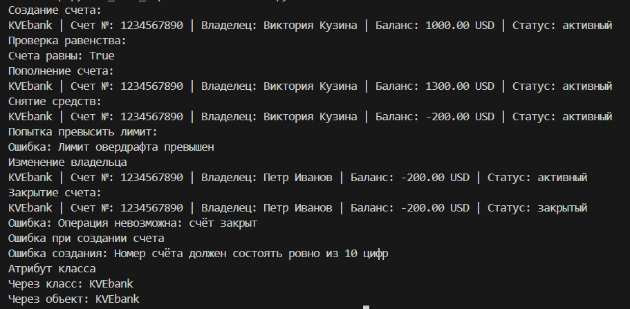

# Ладораторная работа 1 
## Класс и инкапсуляция
Выполнен вариант с **банковским счётом** (№4)

**Анализ**:

* Сущность - банковский счёт
* Атрибуты экземпляра - уникальный номер (`account_ID`), владелец (`owner`), баланс (`balance`), валюта (`currency`), состояние счёта (`активный/закрытый`), лимит овердрафта(`overdraft_limit`)
* Атрибут класса - название банка (`KVEbank`)
* Инварианты - в уникальном номере ровно 10 цифр, владелец не может быть пустой строкой, баланс >= -овердрафт, лимит овердрафта >= 0, валюта = {"USD","EUR","RUB"}
* Существует два разных состояния: активный/закрытый 
* Бизнес-методы - пополнение счёта, снятие средств, закрытие счёта

работа разделена на 3 файла: 
* validate.py - валидация данных
* model.py - доменная модель
* demo.py - демонстрация выполнения

Начнем с ***[validate](validate.py)***: устраняет дублирование проверок, валидирует данные.

Продолжим про ***[model](model.py)***: содержит класс `BankAccount`, хранит состояния, контролирует инварианты, реализует бизнес-методы, управляет состоянем объекта. 
- Закрытые поля: `overdraft_limit`, `owner`, `balance`, `currency`, `is_active`
- Свойства **@property**: 
Чтение - `account_ID`, `balance`, `status`, `currency`,`is_active`
Чтение и запись - `owner`
- Метод **setter**: выполняет валидацию
- Инварианты : номер счёта состоит из 10 цифр, валюта принадлежит допустимому списку, баланс не меньше чем -овердрафт лимит, операции не выполняются если счёт закрыт, имя владельца не может быть пустым
- Бизнес методы: пополнение/снятие средств с счёта, закрытие счёта
- Магические методы: `__str__`(строковое представление), `__repr__`(технический вывод для откладки), `__eq__`(сравнение по номеру счёта)

И, наконец, вся демонстрация происходит через ***[demo](demo.py)***: вызывает методы, демонстрирует сценарии и создает объекты. Демонстрация: 

> That's all for README.md, sorry. Check files with code, please