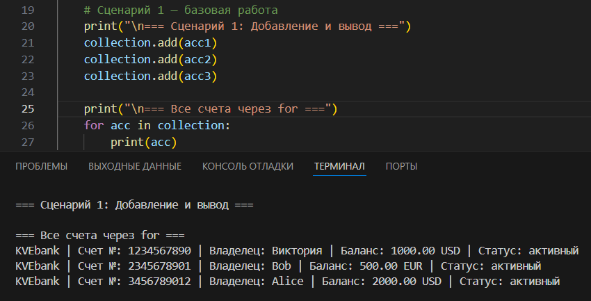
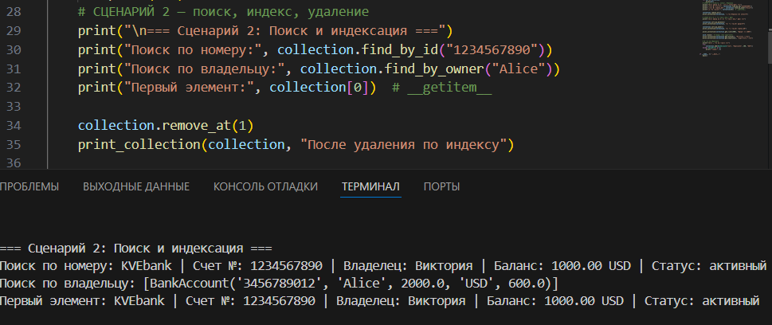
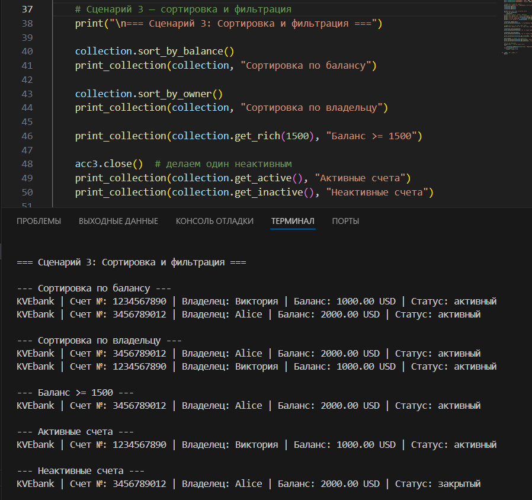
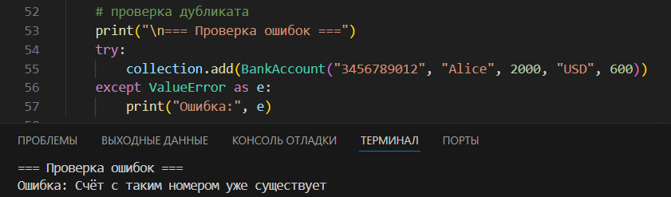

# Лабораторная работа 2. Коллекция объектов

## Описание
Реализован контейнер для хранения банковских счетов (BankAccountCollection)

## Возможности
- Добавление и удаление объектов
- Проверка типа и уникальности
- Поиск по номеру и владельцу
- Итерация по коллекции
- Индексация (collection[0])
- Сортировка
- Фильтрация (активные, неактивные, по балансу)

## Методы коллекции

### Базовые операции
- `add(item)` — добавить счёт
- `remove(item)` — удалить счёт
- `remove_at(index)` — удалить по индексу
- `get_all()` — получить все счета

### Поиск
- `find_by_id(account_number)` — поиск по номеру счёта
- `find_by_owner(owner)` — поиск по имени владельца

### Сортировка
- `sort_by_balance()` — сортировка по балансу
- `sort_by_owner()` — сортировка по владельцу
- `sort(key, reverse)` — универсальная сортировка

### Фильтрация (возвращают новую коллекцию)
- `get_active()` — активные счета
- `get_inactive()` — неактивные счета
- `get_rich(min_balance)` — счета с балансом ≥ порога

## Dunder methods
| Метод | Синтаксис | Назначение |
|-------|----------|------------|
| `__len__` | `len(collection)` | Возвращает количество счетов в коллекции |
| `__iter__` | `for acc in collection` | Позволяет итерироваться по счетам |
| `__getitem__` | `collection[0]`, `collection[-1]` | Доступ к счету по индексу |

## Демонстрация работы

### Сценарий 1: Добавление и итерация
- Создание 3 счетов
- Добавление в коллекцию
- Вывод всех счетов через `for`

### Сценарий 2: Поиск, индексация, удаление
- Поиск по номеру счета (`find_by_id`)
- Поиск по владельцу (`find_by_owner`)
- Доступ по индексу (`collection[0]`)
- Удаление по индексу (`remove_at`)

### Сценарий 3: Сортировка и фильтрация
- Сортировка по балансу (`sort_by_balance`)
- Сортировка по владельцу (`sort_by_owner`)
- Фильтрация по минимальному балансу (`get_rich`)
- Фильтрация активных/неактивных счетов (`get_active`, `get_inactive`)

### Проверка ошибок
- Попытка добавить дубликат -> `ValueError`

