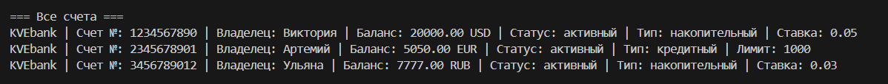
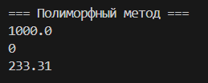
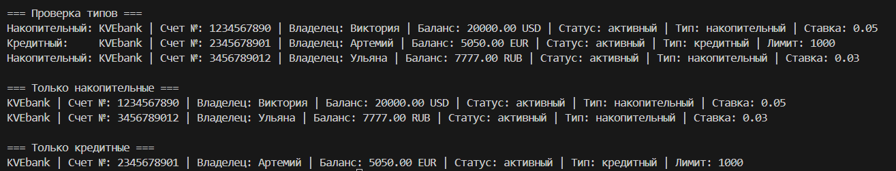

# ЛР-3: Наследование и иерархия классов

##  Описание реализованной иерархии

### Базовый класс: `BankAccount`

Содержит:

* номер счёта
* владельца
* баланс
* валюту
* методы работы со счётом

### Дочерний класс: SavingsAccount

Особенности:

* процентная ставка (interest_rate)
* начисление дохода

Методы:

* `calculate()` — рассчитывает доход от процентов

### Дочерний класс: `CreditAccount`

Особенности:

* кредитный лимит (credit_limit)
* процентная ставка

Методы:

* `calculate()` — рассчитывает проценты по долгу

### Отличия классов

* `SavingsAccount` работает с положительным балансом и доходом
* `CreditAccount` работает с долгом и процентами

## Работа с коллекцией

Коллекция (`BankAccountCollection`) хранит объекты разных типов:

* `SavingsAccount`
* `CreditAccount`

### Возможности:

* добавление объектов
* итерация
* фильтрация по типу:

  * `get_savings()`
  * `get_credit()`

## Демонстрация работы

### Сценарий 1: Работа с разными типами

Создаётся коллекция, содержащая разные типы счетов.

### Сценарий 2: Полиморфизм

Один и тот же метод вызывается у разных объектов:

**Результат:**

* для накопительного счёта — доход
* для кредитного — проценты по долгу

### Сценарий 3: Фильтрация по типу

Позволяет получить только нужный тип объектов

## Ключевые моменты реализации

* Использовано наследование от базового класса
* Применён `super()` для переиспользования кода
* Реализовано переопределение методов (`calculate`)
* Использован полиморфизм без `if`
* Реализована фильтрация через `isinstance()`
