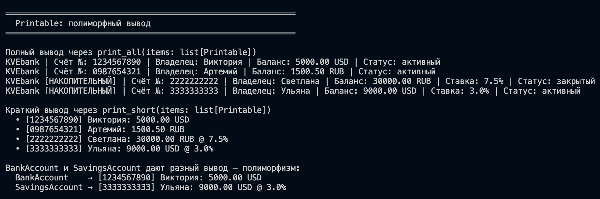
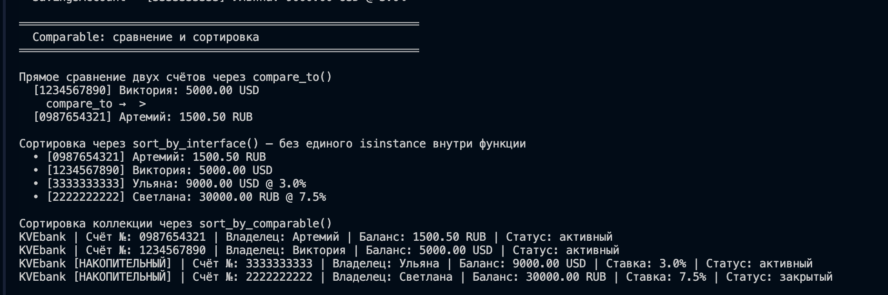
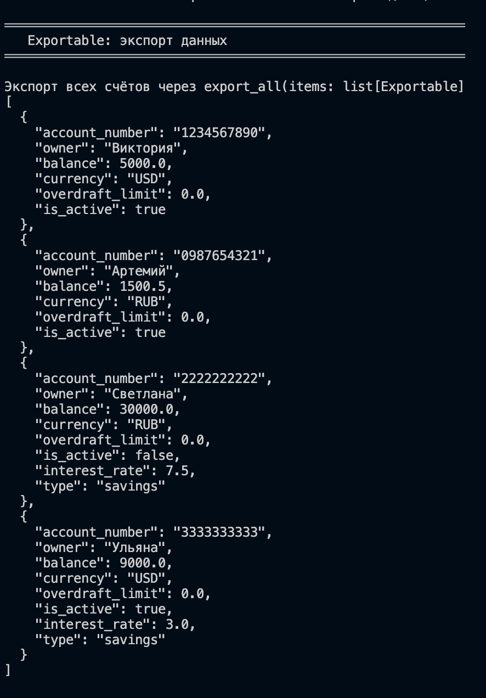
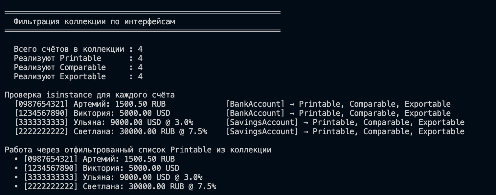

# ЛР-4 — Интерфейсы и абстрактные классы (ABC)

## 1. Цель работы

В данной лабораторной работе изучались:

- **Абстрактные базовые классы (ABC)** 
- **Интерфейсы** 
- **Полиморфизм через интерфейс** 
- **Множественная реализация интерфейсов** 

---

## 2. Описание интерфейсов

Все интерфейсы находятся в файле [`interfaces.py`](src/lab04/interfaces.py).

### `Printable`

| Абстрактный метод | Описание |
|---|---|
| `to_string() -> str` | Полное представление объекта для человека|
| `to_short_string() -> str` | Краткое однострочное представление |

### `Comparable`

| Абстрактный метод | Описание |
|---|---|
| `compare_to(other) -> int` | Возвращает `-1`, `0` или `1` |

### `Exportable`

| Абстрактный метод | Описание |
|---|---|
| `to_dict() -> dict` | Возвращает словарь с данными объекта (для сериализации / экспорта в JSON) |

---

## 3. Реализация в классах

Классы находятся в файле [`models.py`](src/lab04/models.py).

### `BankAccount`  реализует `Printable`, `Comparable`, `Exportable`

| Метод | Реализация |
|---|---|
| `to_string()` | `KVEbank \| Счёт №: … \| Владелец: … \| Баланс: … \| Статус: …` |
| `to_short_string()` | `[номер] Владелец: баланс валюта` |
| `compare_to(other)` | Сравнение **по балансу** |
| `to_dict()` | 6 полей: `account_number`, `owner`, `balance`, `currency`, `overdraft_limit`, `is_active` |

### `SavingsAccount(BankAccount)` → реализует `Printable`, `Comparable`, `Exportable`

Наследует `BankAccount` и **переопределяет** все методы интерфейсов, добавляя информацию о процентной ставке.

| Метод | Отличие от `BankAccount` |
|---|---|
| `to_string()` | Добавляет пометку `[накопительный]` и строку `Ставка: X%` |
| `to_short_string()` | Добавляет  `@ X%` |
| `compare_to(other)` | Сравнение по **доходному потенциалу**: `balance × (1 + rate/100)` |
| `to_dict()` | Дополнительные ключи `interest_rate` и `type: "savings"` |

### `BankAccountCollection` — методы для работы через интерфейсы

| Метод | Интерфейс | Описание |
|---|---|---|
| `get_printable()` | `Printable` | Фильтрует объекты, реализующие `Printable` |
| `get_comparable()` | `Comparable` | Фильтрует объекты, реализующие `Comparable` |
| `get_exportable()` | `Exportable` | Фильтрует объекты, реализующие `Exportable` |
| `sort_by_comparable()` | `Comparable` | Сортировка через `compare_to()` без `isinstance` внутри |
| `print_all()` | `Printable` | Полиморфный вывод всех счётов |
| `export_all()` | `Exportable` | Экспорт всех счётов в список словарей |

---

## 4. Демонстрация

### Printable: полиморфный вывод

### Сценарий 2 — Comparable: сравнение и сортировка

### Сценарий 3 — Exportable: экспорт данных

### Сценарий 4 — Фильтрация коллекции по интерфейсам + isinstance
