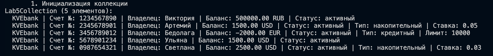
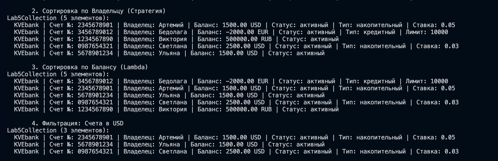
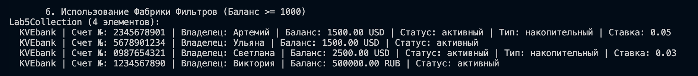
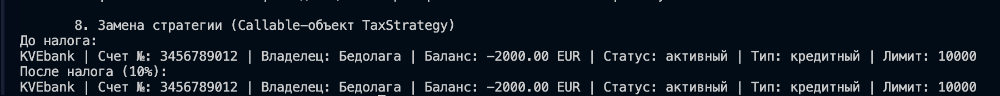

# Лабораторная работа №5: Функции как аргументы. Стратегии и делегаты.

## 1. Цель работы
Освоить передачу функций как аргументов, использование функций высшего порядка (`map`, `filter`, `sorted`), реализацию паттерна «Стратегия» через callable-объекты и применение lambda-выражений.

## 2. Реализованные функции и стратегии

### Сортировка
- `sort_by_owner`: Сортировка по имени владельца.
- `sort_by_balance`: Сортировка по балансу.
- `sort_by_currency_and_balance`: Комбинированная сортировка.

### Фильтрация 
- `filter_active`: Выбор активных счетов.
- `is_usd_account`: Выбор счетов в валюте USD.

### Преобразование и Фабрики 
- `to_full_dict`: Маппинг объекта в словарь (используется через `map`).
- `make_min_balance_filter`: Фабрика, создающая предикат для фильтрации по балансу.
- `make_type_filter`: Фабрика для фильтрации по классу (Savings/Credit).

### Паттерн «Стратегия» и Сallable-объекты 
- `BonusStrategy`: Класс-стратегия для начисления бонусов.
- `TaxStrategy`: Класс-стратегия для списания налогов.
- Реализована поддержка **цепочек вызовов** (Method Chaining) в `Lab5Collection`.

## 3. Демонстрация работы

1. Создание коллекции с разными типами счетов.

2. Сортировка и фильтрация с использованием именованных функций и lambda.

3. Трансформация данных через `map`.

4. Работа фабрик функций.

5. Выполнение цепочки: `filter_by` -> `sort_by` -> `apply`.

6. Динамическая замена стратегии обработки без изменения кода коллекции.

