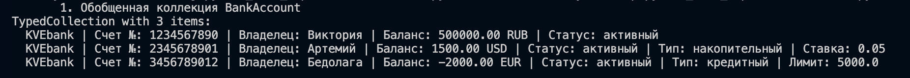
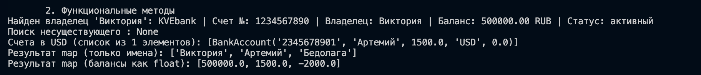
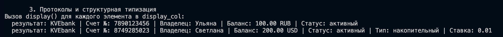
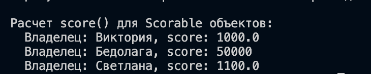

# ЛР-6 — Generics и typing

## Цель работы

* Освоить систему аннотаций типов в Python (`typing`).
* Научиться создавать **обобщённые (generic) классы** с помощью `TypeVar` и `Generic`.
* Понять концепцию **структурной типизации** через `typing.Protocol`.

## 2. Описание реализации

### Типизированные модели 
Все классы (`BankAccount`, `SavingsAccount`, `CreditAccount`) были обновлены с добавлением аннотаций типов:
- Параметры конструкторов и возвращаемые значения методов строго типизированы.
- Атрибуты классов имеют явные указания типов.

### Обобщенный контейнер 
В файле `container.py` реализован класс `TypedCollection(Generic[T])`, который:
- Повторяет интерфейс коллекции из ЛР-2, но гарантирует безопасность типов содержимого.
- Реализует методы:
    - `find(predicate) -> Optional[T]`: поиск элемента.
    - `filter(predicate) -> list[T]`: фильтрация по условию.
    - `map(transform) -> list[R]`: трансформация элементов в список объектов другого типа (`TypeVar R`).

### Структурная типизация (Protocols)
Реализованы два протокола:
1. `Displayable`: требует наличия метода `display() -> str`.
2. `Scorable`: требует наличия метода `score() -> float`.

Классы не наследуются от протоколов явно. Соответствие проверяется динамически по наличию методов (Duck Typing), что продемонстрировано в `demo.py`.

## 3. Демонстрация работы

Демонстрация в `demo.py` 
1. **Типизированная коллекция**: Создание `TypedCollection[BankAccount]`, наполнение её объектами и проверка корректности данных.

2. **Функциональные методы**: Применение `map` для извлечения имен (`list[str]`) и балансов (`list[float]`), что демонстрирует работу `TypeVar R`.

3. **Работа с Протоколами**: 
   - `TypedCollection[Displayable]` принимает любые счета, так как у них реализован метод `display()`.
   
   - `TypedCollection[Scorable]` позволяет вычислить "рейтинг" счетов разных типов (баланс для обычных, ставка для накопительных, лимит для кредитных).
   

## 4. Вывод
Использование `Generics` и `typing` позволяет:
- Выявлять ошибки на этапе написания кода (статический анализ).
- Создавать гибкие интерфейсы через `Protocol`, не связывая классы жесткой иерархией наследования.
